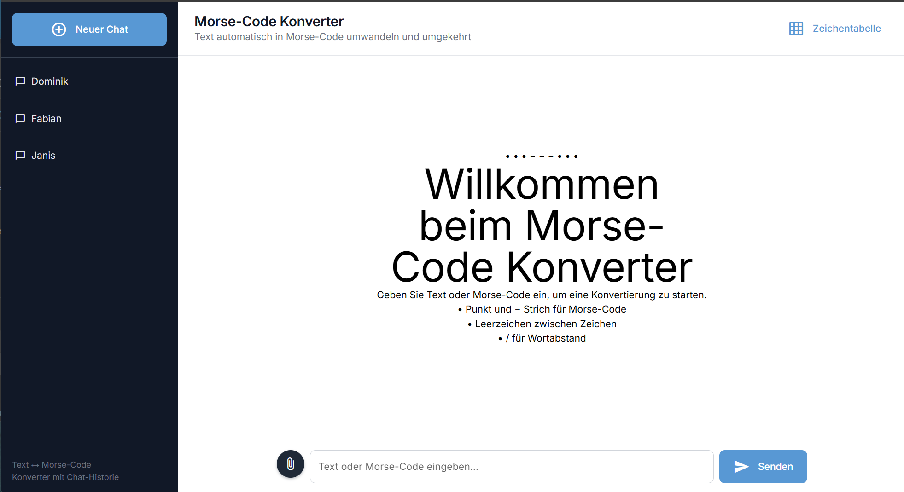
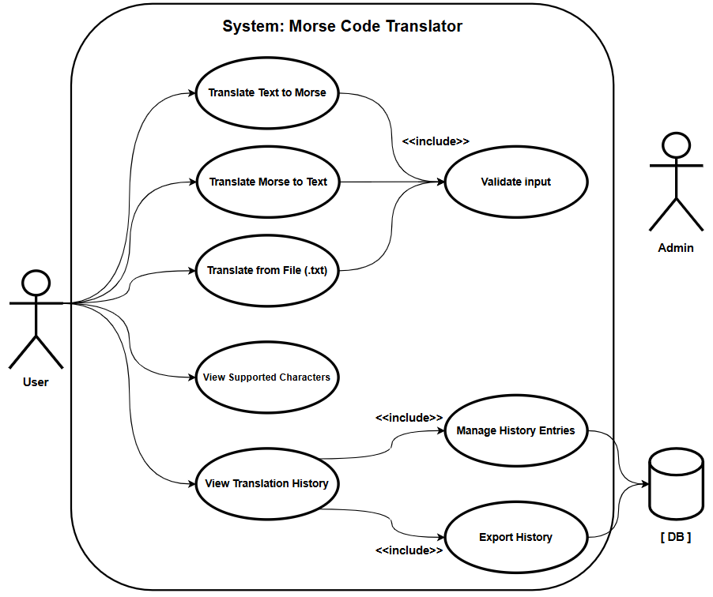
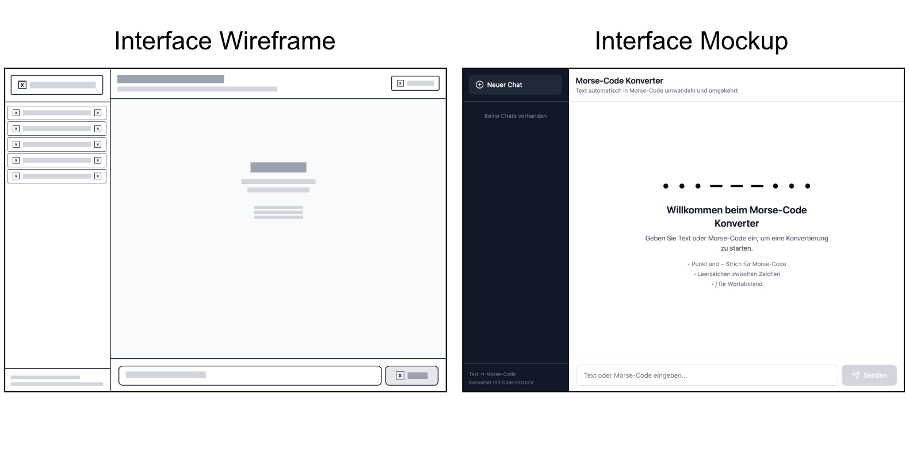
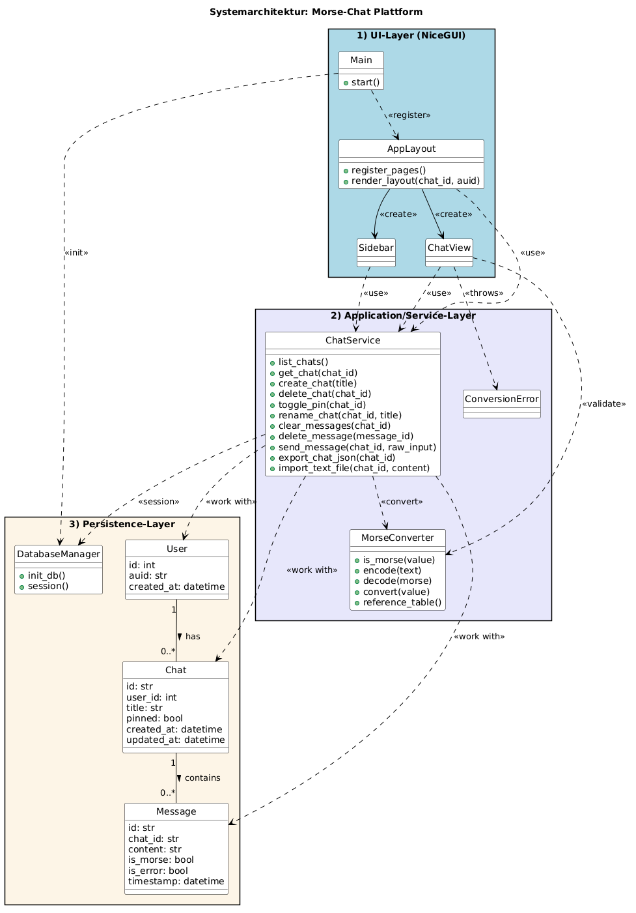
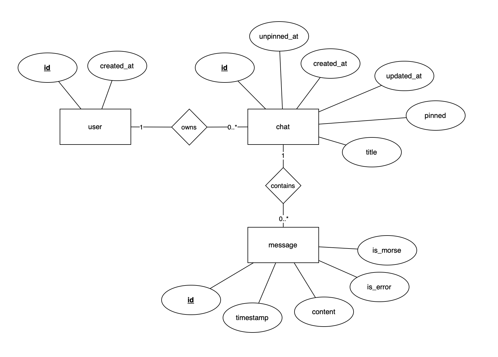

# 🆘 Morse Code De-/Encoder (Browser App)



---

This project demonstrates the development of a browser-based application using **NiceGUI**, focusing on clean architecture, data validation, and database persistence with SQLite (managed via SQLAlchemy).

It aims to:

- Cover the full process from **requirements analysis to implementation**
- Apply advanced **Python** concepts in a web-based application
- Demonstrate **data validation**, layered architecture, and database persistence
- Produce clean, maintainable, and well-tested code
- Support **teamwork and professional documentation**

###### 

## 📝 Application Requirements

**Problem**
People are curious about Morse code, but translating messages by hand is tedious and easy to get wrong (spacing, word separators, and unsupported characters). A simple tool is needed that converts **text ⇄ Morse code** quickly, validates input to prevent mistakes, and produces consistent, reliable results.

**Scenario**
A user wants to encode messages into Morse code for practice or signaling, or decode received Morse sequences into readable text. They use the application via a chat-like interface, entering either plain text or Morse code (or providing a `.txt` file), and get the translation immediately. The app also stores a conversion history so previous inputs and outputs can be reviewed later.

## User stories

### 1. Chat-Like Interface  
#### As a user, I want to interact with the application in a chat-style interface.  
**Description:** The application displays inputs and outputs as conversational messages, so I can see both my requests and the system’s responses in a single chat history.  
**Inputs:** user message | `str`  
**Outputs:** chat message | `dict`

---

### 2. Translate Text to Morse Code  
#### As a user, I want to translate text into Morse code in the chat.  
**Description:** When I enter plain text, the system responds with the Morse code translation as a chat message.  
**Inputs:** text message | `str`  
**Outputs:** Morse code message | `str`  

---

### 3. Translate Morse Code to Text  
#### As a user, I want to translate Morse code into readable text in the chat.  
**Description:** When I enter Morse code, the system responds with the decoded text as a chat message.  
**Inputs:** Morse code message | `str`  
**Outputs:** decoded text message | `str`  

---

### 4. Validate Text Input  
#### As a user, I want to receive error messages for invalid or unsupported text input.  
**Description:** The system validates text messages and responds with an error message if unsupported characters are entered.  
**Inputs:** text message | `str`  
**Outputs:** error message | `str` or processed result | `str`  

---

### 5. Validate Morse Code Input  
#### As a user, I want to receive error messages for invalid Morse code input.  
**Description:** The system validates Morse code messages and responds with an error message if the sequence is invalid or unknown.  
**Inputs:** Morse code message | `str`  
**Outputs:** error message | `str` or processed result | `str`  

---

### 6. Display Supported Characters  
#### As a user, I want to see which characters are supported.  
**Description:** The system can send a chat message listing all supported characters and their Morse code equivalents.  
**Inputs:** user request | `str`  
**Outputs:** supported characters message | `dict` (keys: `char: str`, `morse: str`)  

---

### 7. File-Based Translation in Chat  
#### As a user, I want to upload a text file and translate its content in the chat.  
**Description:** When I upload a `.txt` file, the system reads the file and responds with the encoded or decoded content as a chat message.  
**Inputs:** file | `.txt`  
**Outputs:** translated content message | `str`  

---

### 8. File Validation  
#### As a user, I want to receive error messages for invalid or unsupported files.  
**Description:** The system validates uploaded files and responds with an error message if the file format or content is unsupported.  
**Inputs:** file | `any`  
**Outputs:** error message | `str` or none | `NoneType`  

---

### 9. Chat and Message Management  
#### As a user, I want to manage multiple chats and individual messages.  
**Description:**  
- Users can create multiple chat sessions and switch between them.  
- Entire chats can be pinned & deleted.  
- Individual messages within a chat can be deleted or copied.  
- All messages (user and system) remain stored in the chat history for each session. 

**Inputs:** chat or message action `dict`  
**Outputs:** updated chat sessions or messages | `list[dict]`

---

### 10. Export Chat History  
#### As a user, I want to download my chat history.  
**Description:** The system allows exporting a full chat conversation (messages and responses) in a structured format.  
**Inputs:** export request | `str`  
**Outputs:** downloadable file | `.json`  

---

## 🧩 Use Cases




### Main Use Cases

- Translate Text (User)
- Translate Morse (User) 
- Translate from file .txt (User)
- View supported characters (User)
- View translation history (User)
  - Manage history entries (User)
  - Export History (User)

- Validate input (Admin)

**Actors**
- User (acts with chatbot)
- Admin (validates input)

---

### Wireframes / Mockups



---

## 🏛️ Architecture



### Layers
- **UI:** NiceGUI (browser-based interface)
- **Application logic:** service layer (`ChatService`, `MorseConverter`)
- **Persistence:** SQLite + SQLAlchemy (models + `DatabaseManager`)

### Design Decisions
- Layered architecture with a clear separation of concerns
- Business logic is kept independent from the UI (UI calls services, services handle conversions + persistence)
- One DB session per service operation (the UI does not manage database sessions)

### Design Patterns Used
- Layered MVC variant: A UI layer (views), a service layer (application logic), and a persistence layer (database access) keep responsibilities separated and make the code easier to test and maintain.
- Facade pattern: `DatabaseManager` hides database setup details (engine, sessions, schema creation) so the rest of the application can work with a simple, consistent interface.

---

## 🗄️ Database

The application persists data in a local **SQLite** database (`morse_chat.db`) using **SQLAlchemy**.



### Entities
- `User` (reflects an anonymous user using browser sessions)
- `Chat` (chat sessions, pinned state, timestamps)
- `Message` (either morse, text or error)

### Relationships
- One `User` → many `Chat`
- One `Chat` → many `Message`

---

## ✅ Project Requirements

Each app must meet the following criteria in order to be accepted:

1. Interactive web app using NiceGUI
2. Data validation in the web app
3. File processing (read/write)
4. Database management and persistence (SQLite via SQLAlchemy)

---

### 1. Browser-based App (NiceGUI)

The application runs as a browser-based NiceGUI app. Users can:

* Create and switch between chat sessions (sidebar)
* Enter **plain text** or **Morse code** in the chat input and receive the converted result as a response message
* Upload a `.txt` file directly in the chat (content is read and converted)
* Open a reference table of supported characters
* Export a chat conversation as a `.json` download

---

### 2. Data Validation

The application validates all user input to ensure correctness:

* **Empty input handling:** Empty messages are ignored.
* **Text validation:** Unsupported characters are rejected with a clear error message.
* **Morse validation:** Invalid or unknown Morse sequences are rejected. Morse input uses spaces between tokens and `/` as word separator.
* **File validation:** Only `.txt` files are accepted (max. 500 KB). The file must be valid UTF-8 text, non-empty, and must not mix plain text with standalone Morse tokens.

Invalid Morse sequences and unsupported characters are flagged, preventing crashes or incorrect translations.
Words in Morse code are correctly interpreted using `/` as word separator.

---

### 3. File Processing

The app supports reading text from `.txt` uploads:

* The file content is read in the browser app, normalized (whitespace), and then converted as either **text → Morse** or **Morse → text**.
* For write/export functionality, the user can download the current chat history as a JSON file.

---

### 4. Database management and persistence

The application persists users, chats, and messages in a local SQLite database (`morse_chat.db`) using SQLAlchemy.

---

## ⚙️ Implementation

### Technology

* Python 3.x
* NiceGUI
* pytest

---

### 📚 Libraries Used

- **nicegui** – UI framework  
- **sqlalchemy** – database toolkit (SQLite persistence)  
- **python-dotenv** – configuration  
- **pytest** – testing  
- **pytest-asyncio** – async test support  
- **ruff** – linting/formatting  

---

### 📂 Repository Structure

```text
3-25HS.W-B-WI-GrPro_morse-code-converter
├── README.md
├── app
│   ├── db
│   │   ├── __init__.py
│   │   ├── database_manager.py
│   │   └── models
│   ├── main.py
│   ├── models
│   ├── services
│   │   ├── __init__.py
│   │   ├── chat_service.py
│   │   └── morse_converter.py
│   └── ui
│       ├── __init__.py
│       ├── app_layout.py
│       ├── chat_view.py
│       ├── favicon.png
│       ├── message_bubble.py
│       ├── sidebar.py
│       └── styles.py
├── docs
│   ├── ui-images
│   │   └── wireframe-mockup.jpg
│   └── use_cases.png
├── morse_chat.db
├── pyproject.toml
└── tests
    └── test_e2e.py

```

### Project Setup

1. Verify Python is installed:
```bash
python --version
```
2. Install required dependencies:
```bash
python -m pip install -e .
```
3. Start the app (from the repository root):
```bash
python app/main.py
```
4. Open `http://localhost:8080` in your browser.

5. Create a new chat
6. Enter text or Morse code and send
7. Upload a `.txt` file to convert its content

## 🧪 Testing

Run all tests with:

```bash
python -m pytest -q
```

**Test mix (10 tests):**
- 3 Unit tests (`tests/test_unit.py`)
- 4 Integration tests (`tests/test_integration.py`)
- 3 DB tests (`tests/test_db.py`)

### Test cases

**TC_001 — Encode text to Morse (SOS)**
1. Test case ID – TC_001
2. Test case title/description – Encode "SOS" to Morse code
3. Preconditions: Project dependencies installed
4. Test steps: Run `pytest` and execute unit tests
5. Test data/input: `"SOS"`
6. Expected result: Output equals `"... --- ..."`
7. Actual result: _filled during execution_
8. Status – pass or fail: _filled during execution_
9. Comments – Additional notes or defect found: -

**TC_002 — Decode Morse to text (SOS)**
1. Test case ID – TC_002
2. Test case title/description – Decode "... --- ..." to text
3. Preconditions: Project dependencies installed
4. Test steps: Run `pytest` and execute unit tests
5. Test data/input: `"... --- ..."`
6. Expected result: Output equals `"SOS"`
7. Actual result: _filled during execution_
8. Status – pass or fail: _filled during execution_
9. Comments – Additional notes or defect found: -

**TC_003 — Reject unsupported text characters**
1. Test case ID – TC_003
2. Test case title/description – Encoding fails for unsupported characters
3. Preconditions: Project dependencies installed
4. Test steps: Run `pytest` and execute unit tests
5. Test data/input: `"Hello 😊"`
6. Expected result: `ConversionError` is raised
7. Actual result: _filled during execution_
8. Status – pass or fail: _filled during execution_
9. Comments – Additional notes or defect found: -

**TC_004 — Create chat and list chats**
1. Test case ID – TC_004
2. Test case title/description – New chats are persisted and shown in list
3. Preconditions: Fresh test database (temporary SQLite file)
4. Test steps: Create two chats via `ChatService`, call `list_chats`
5. Test data/input: Titles `"Chat 1"`, `"Chat 2"`
6. Expected result: Both chat IDs are present in `list_chats()` result
7. Actual result: _filled during execution_
8. Status – pass or fail: _filled during execution_
9. Comments – Additional notes or defect found: -

**TC_005 — Send message creates response**
1. Test case ID – TC_005
2. Test case title/description – Sending "HI" stores user message + converted bot message
3. Preconditions: Fresh test database (temporary SQLite file)
4. Test steps: Create chat, send message, verify returned messages
5. Test data/input: `"HI"`
6. Expected result: Two messages stored; bot content equals `".... .."`
7. Actual result: _filled during execution_
8. Status – pass or fail: _filled during execution_
9. Comments – Additional notes or defect found: -

**TC_006 — Export chat history JSON**
1. Test case ID – TC_006
2. Test case title/description – Export returns structured JSON including messages
3. Preconditions: Fresh test database (temporary SQLite file) and a chat with messages
4. Test steps: Send a message, call `export_chat_json`, parse JSON
5. Test data/input: Chat containing a conversion
6. Expected result: JSON contains chat `id` and two messages
7. Actual result: _filled during execution_
8. Status – pass or fail: _filled during execution_
9. Comments – Additional notes or defect found: -

**TC_007 — Pin/unpin chat**
1. Test case ID – TC_007
2. Test case title/description – Pin toggle flips `pinned` state
3. Preconditions: Fresh test database (temporary SQLite file)
4. Test steps: Create chat, call `toggle_pin` twice
5. Test data/input: Chat ID
6. Expected result: First toggle returns `True`, second returns `False`
7. Actual result: _filled during execution_
8. Status – pass or fail: _filled during execution_
9. Comments – Additional notes or defect found: -

**TC_008 — DB schema creation**
1. Test case ID – TC_008
2. Test case title/description – `init_db` creates core tables
3. Preconditions: Fresh test database (temporary SQLite file)
4. Test steps: Run `DatabaseManager.init_db()`, inspect tables
5. Test data/input: -
6. Expected result: Tables `users`, `chats`, `messages` exist
7. Actual result: _filled during execution_
8. Status – pass or fail: _filled during execution_
9. Comments – Additional notes or defect found: -

**TC_009 — Unique user constraint**
1. Test case ID – TC_009
2. Test case title/description – `User.auid` must be unique
3. Preconditions: Fresh test database (temporary SQLite file)
4. Test steps: Insert two users with same `auid`
5. Test data/input: `auid = "same-auid"`
6. Expected result: Second insert raises `IntegrityError`
7. Actual result: _filled during execution_
8. Status – pass or fail: _filled during execution_
9. Comments – Additional notes or defect found: -

**TC_010 — Delete chat deletes messages**
1. Test case ID – TC_010
2. Test case title/description – Deleting a chat removes related messages
3. Preconditions: Fresh test database (temporary SQLite file) and chat with a message
4. Test steps: Create user/chat/message, delete chat, query messages
5. Test data/input: One chat with one message
6. Expected result: No messages remain for the deleted chat
7. Actual result: _filled during execution_
8. Status – pass or fail: _filled during execution_
9. Comments – Additional notes or defect found: -

---

## 👥 Team & Contributions

| Name          | Contribution                                                                              |
| ------------- | ----------------------------------------------------------------------------------------- |
| Janis Huser   | Business logic, `.txt` upload/file processing & documentation                             |
| Fabian Jäggi  | NiceGUI UI, Morse encoding/decoding & documentation                                       |
| Dominik Suter | Database layer (SQLite/SQLAlchemy), automated testing & documentation                     |

---

## 📝 License

This project is provided for **educational use only** as part of the Programming Foundations module.
[MIT License](LICENSE)